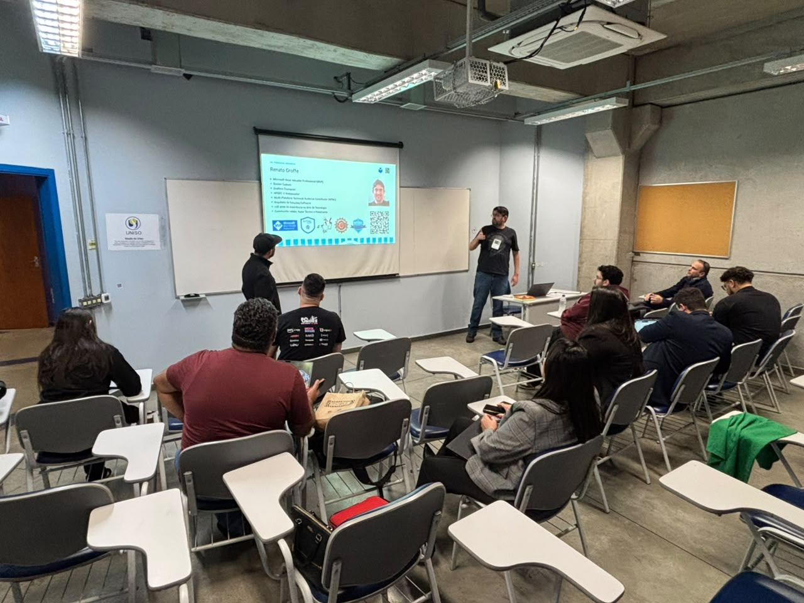
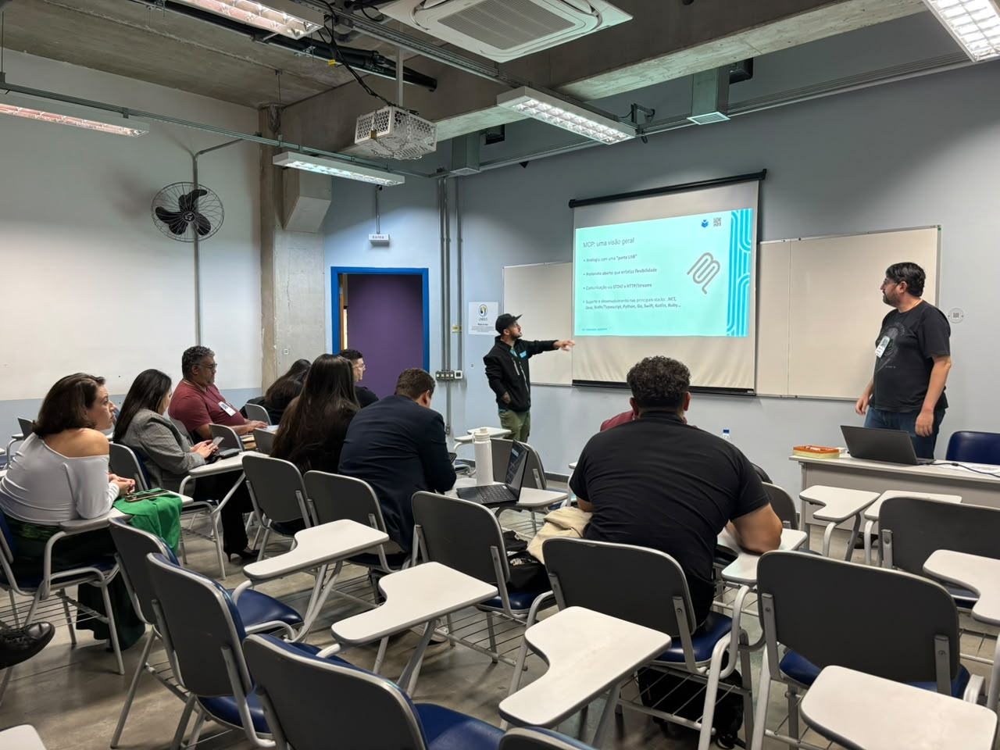
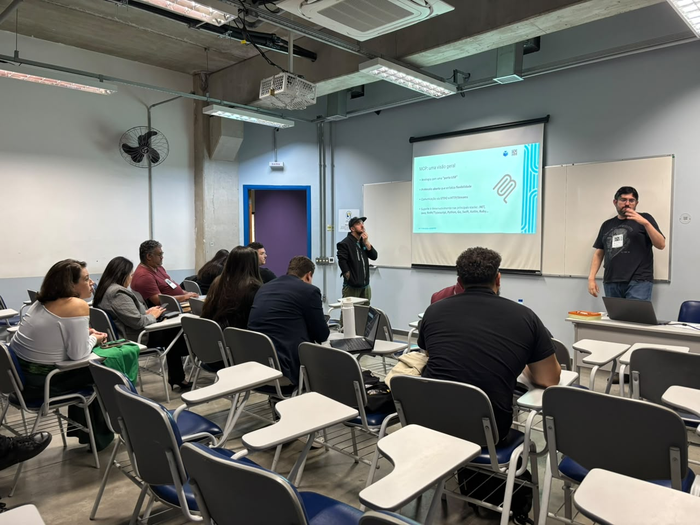
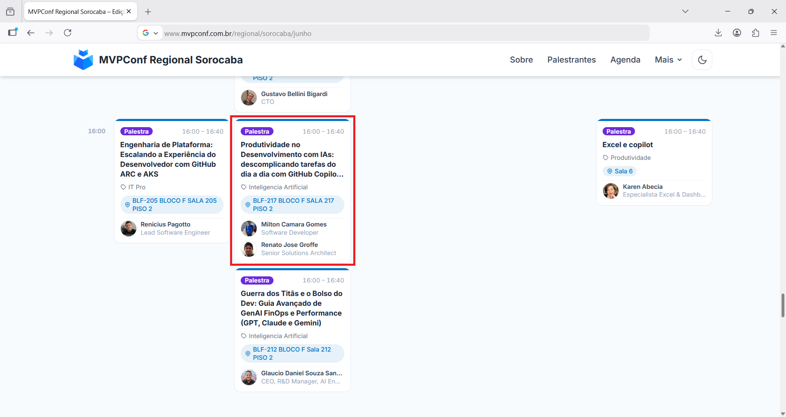

# produtividade-ias-mcps_mvpconf-sorocaba-2026-06
Slides and content for the presentation "Productivity in Development with AIs: simplifying everyday tasks with GitHub Copilot + MCP Servers".

## Useful MCP Servers for Application Development

| Description | Command / Activation URL | Link |
|-------------|--------------------------|------|
| Microsoft Learn Official MCP | `https://learn.microsoft.com/api/mcp` | https://github.com/microsoftdocs/mcp |
| Fake data generation MCP | `docker run -i --rm renatogroffe/dotnet10-consoleapp-mcp-fakedata` | Application: https://github.com/renatogroffe/dotnet10-consoleapp-mcp-fakedata  GitHub Actions workflow for k6 tests: https://github.com/renatogroffe/k6-mcps-tests-docker-github-actions |
| Official draw.io MCP | `https://mcp.draw.io/mcp` | https://github.com/jgraph/drawio-mcp |
| Official Excalidraw MCP | `https://mcp.excalidraw.com` | https://github.com/excalidraw/excalidraw-mcp |
| Official Postgres extension (includes MCP Server) | - | https://marketplace.visualstudio.com/items?itemName=ms-ossdata.vscode-pgsql |
| Official SQL Server extension (includes MCP Server) | - | https://marketplace.visualstudio.com/items?itemName=ms-mssql.mssql |
| Official Mermaid extension (includes MCP Server) | - | https://marketplace.visualstudio.com/items?itemName=MermaidChart.vscode-mermaid-chart |

## References
- Model Context Protocol (MCP): https://github.com/modelcontextprotocol
- Microsoft Agent Framework: https://learn.microsoft.com/en-us/agent-framework/overview/?pivots=programming-language-csharp
- GitHub Copilot: https://github.com/features/copilot?locale=pt-br
- Docker MCP Catalog: https://hub.docker.com/mcp
- OWASP MCP Top 10: https://owasp.org/www-project-mcp-top-10/
- APIsec MCP Discovery and Audit: https://github.com/apisec-inc/mcp-audit
- Free APIsec University Certifications: https://www.apisecuniversity.com/courses

---

## Event information

Presentation title: **Productivity in Development with AIs: simplifying everyday tasks with GitHub Copilot + MCP Servers**

Event: **MVPConf Regional Sorocaba - Edition 2026**

Date: **06/12/2026 (Friday)**

Technologies and topics covered: **MCP, GitHub Copilot, Visual Studio Code, Artificial Intelligence, LLMs, Containers, Docker, Docker Hub, Docker MCP Catalog, Windows, Linux, macOS, .NET, ASP.NET Core, NuGet, Node.js, npm, pip, Python, Claude, SQL Server, PostgreSQL, Mermaid, draw.io, Excalidraw...**

Number of participants: **15 people (estimate)**

Event website: **https://www.mvpconf.com.br/regional/sorocaba/junho**

Location: **UNISO - Campus Cidade Universitária Prof. Aldo Vannucchi, Rod. Raposo Tavares, km 92.5 - Vila Artura - CEP 18023-000**

Access this [**link**](/img/) to view all the photos from the presentation.

This talk was delivered together with my friend **Milton Camara (Microsoft MVP)**.

I would like to thank **Karen Abecia (Microsoft MVP)**, **Rosani Coutinho (MVP Conf)**, **Heber Lopes (MVP Conf)**, and the other organizers for all their support so that we could participate as speakers in this edition of **MVPConf Regional Sorocaba**.

---

